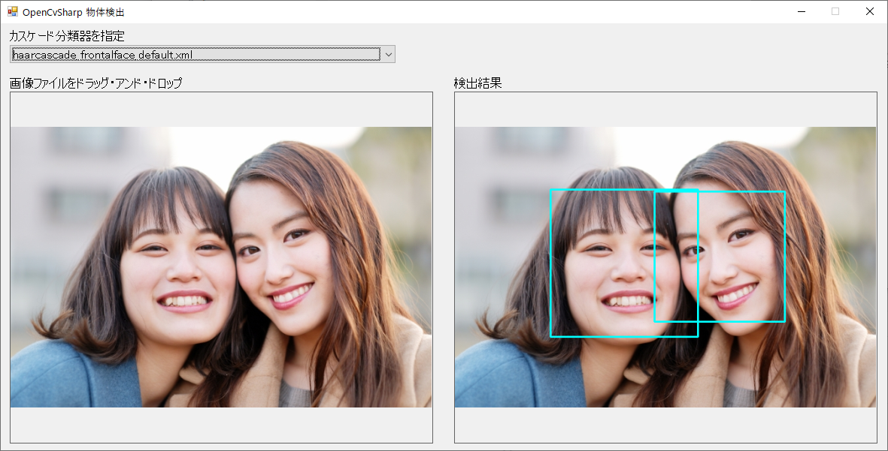

# OpenCvSharpCascadeClassifier

OpenCvSharpを使用し、物体検出（顔認証など）を簡単に行うことができるアプリです。  
OpenCvSharpには、予めカスケード分類器が用意されており、本アプリではそれらの精度を簡単に確認することができます。

詳しい使い方は以下をご覧ください。  
https://new-dev.chigusa-web.com/blog/opencvsharp-cascade-classifier/

